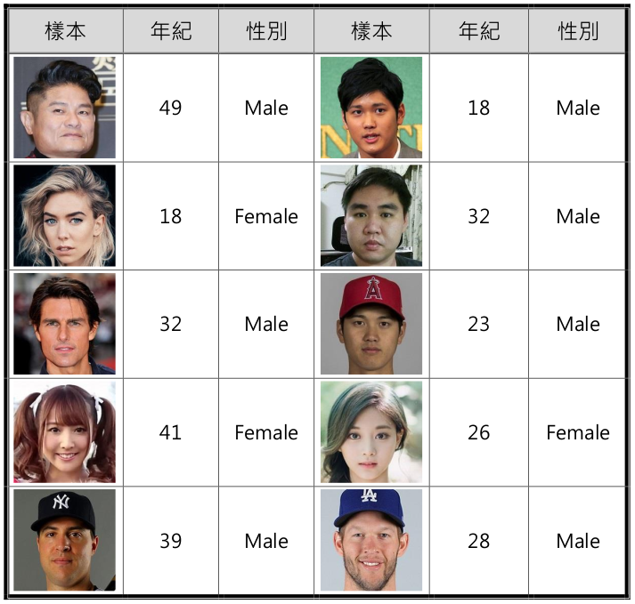

# Age_Gender_Predict

### Version and Requirement
- python -> [3.6.x](https://www.python.org/downloads/)
- opencv -> [3.4.3.18](https://pypi.org/project/opencv-python/3.4.3.18/)
- opencv-contrib -> [3.4.3.18](https://pypi.org/project/opencv-contrib-python/3.4.3.18/)
- tensorflow -> [1.8.0](https://pypi.org/project/tensorflow/1.8.0/)
- keras -> [2.1.5](https://pypi.org/project/Keras/2.1.5/)
- h5py -> [latest](https://pypi.org/project/h5py/)

### Test Result
<p align="center">
    
</p>

### How To Use
Open cmd or powershell then,
```bash
python camera.py
```
---
### Contact Info ###
- Author: khRay13
- email: ray1993.kh@gmail.com
